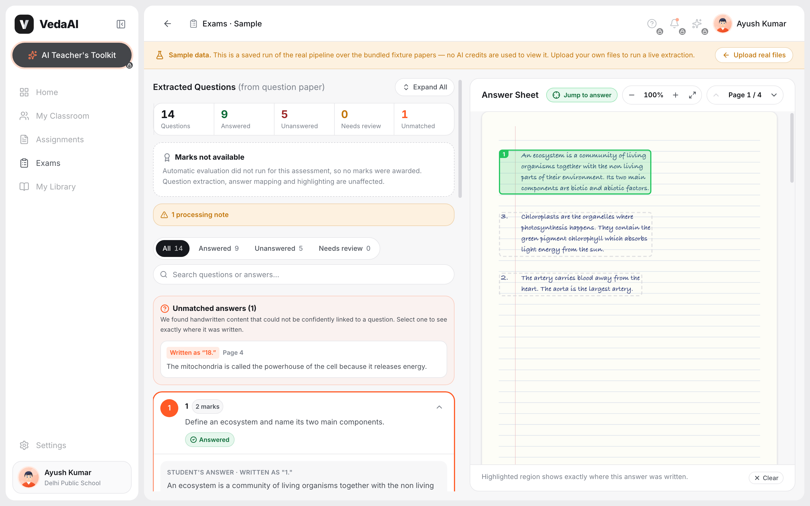
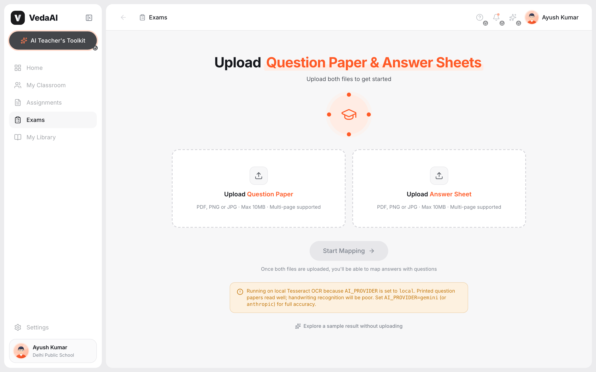
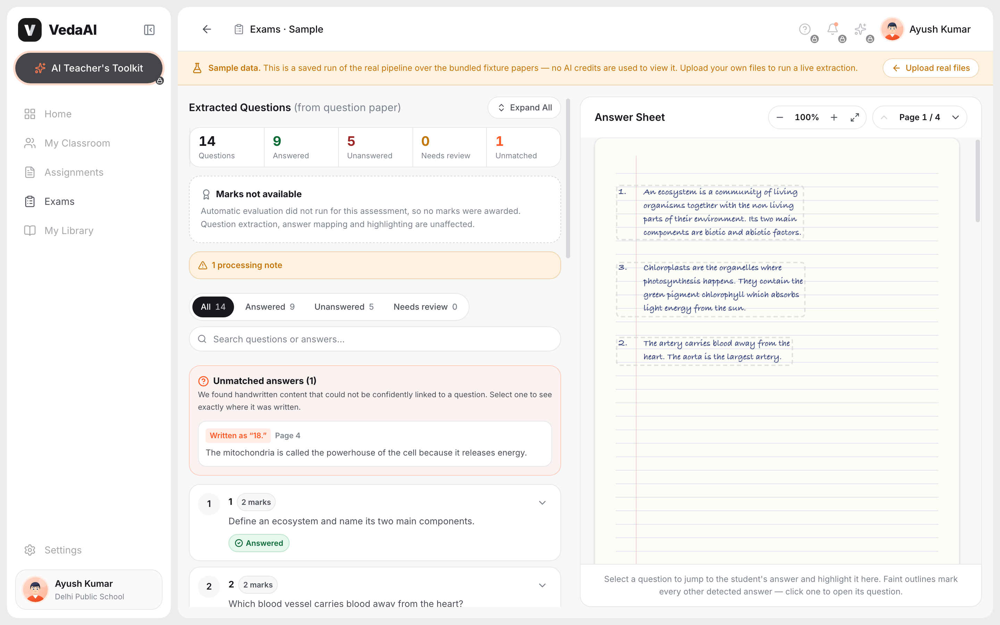
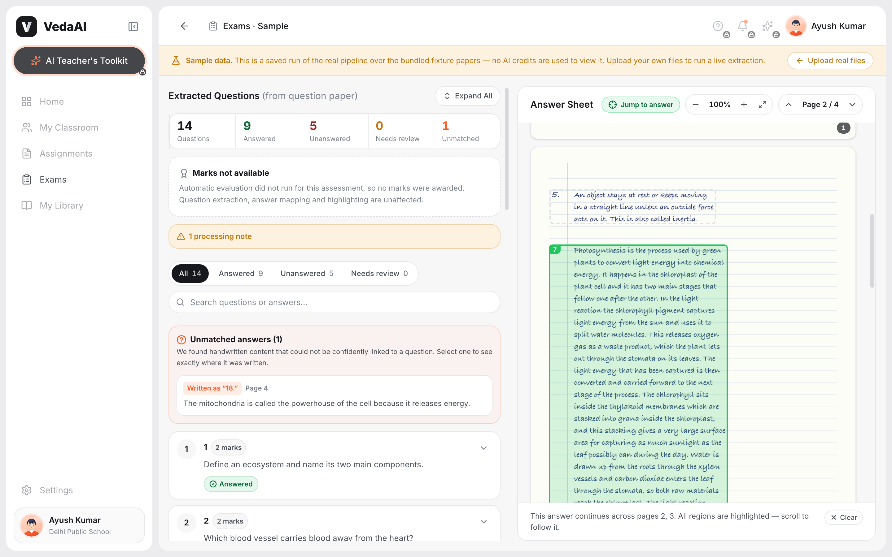
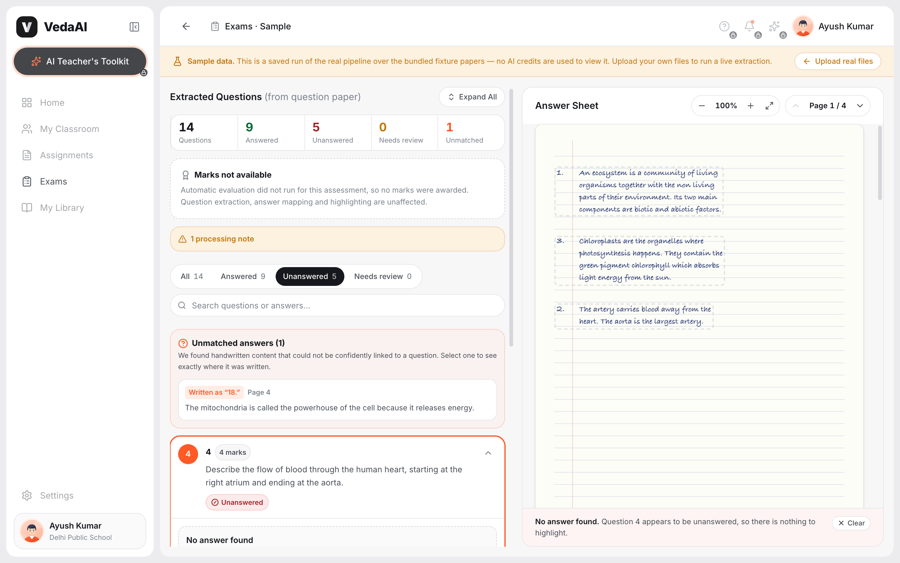
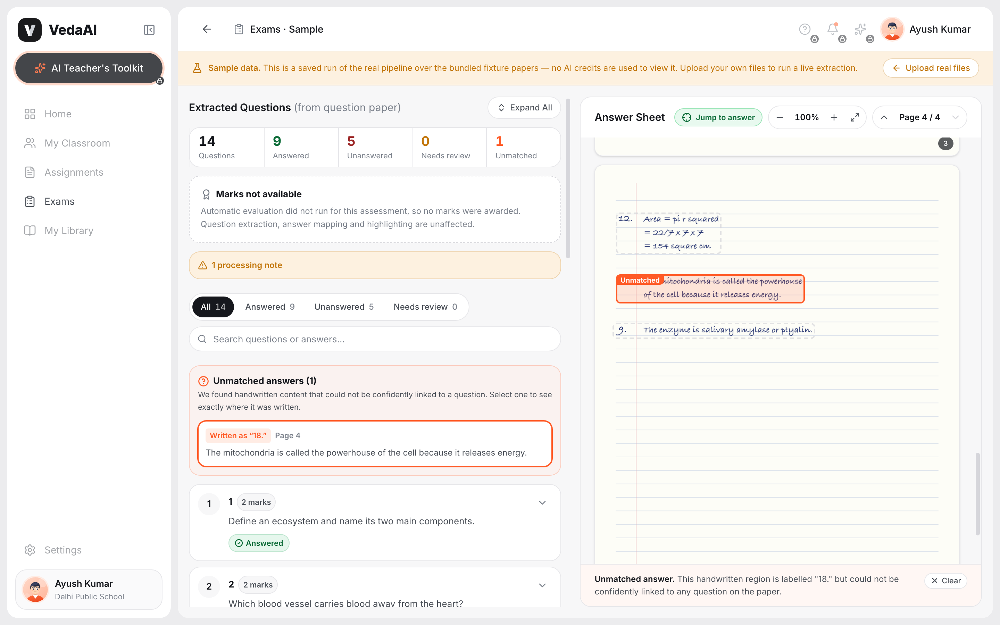
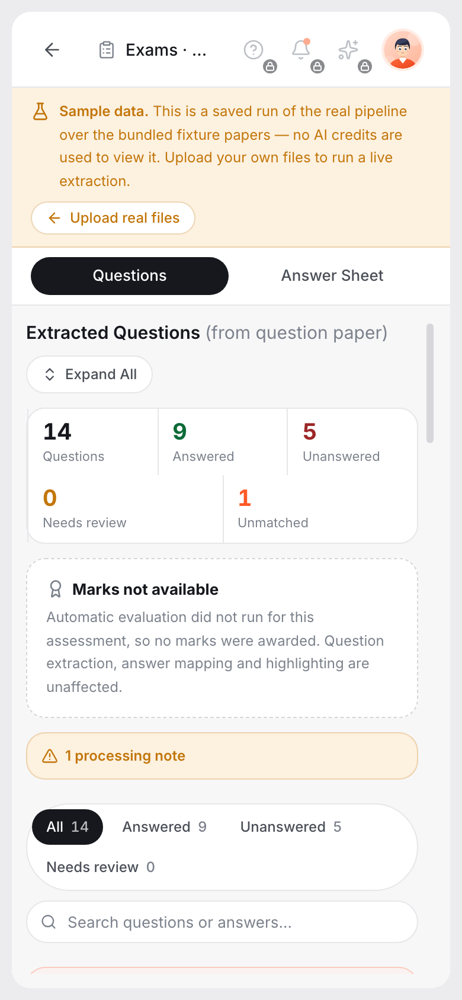

<div align="center">


# Assessment Extraction &amp; Answer Mapping

**Upload a question paper and a student's handwritten answer sheet.
Get every question in printed order, every answer mapped to its question, and
the exact region of the page highlighted when you click.**

Built for the VedaAI hiring assignment.

[Approach](#approach) · [AI model](#ai-model--api) · [Accuracy](#accuracy)
· [Edge cases](#edge-cases) · [Run it](#run-it-locally) · [Limitations](#assumptions--limitations)

</div>

---

## The problem

Marking a paper by hand means holding two documents in your head at once. The
question paper is ordered; the answer sheet almost never is. A student answers
3 before 2, skips 4 entirely, runs question 7 across a page break, and labels an
answer "18" on a paper that stops at 12.

This app does that reconciliation and shows its work.



<sub>Click a question on the left → the sheet scrolls to that answer and outlines
it in green. Every other detected answer stays as a faint dashed outline you can
click to jump back the other way.</sub>

---

## What it does

| | |
|---|---|
| **Extracts every question** in printed order, preserving the original numbering |
| **Treats labelled sub-parts as separate questions** — `11 (a)` and `11 (b)` are two entries, indented under `11` |
| **Reads handwriting** page by page and segments it into discrete answers |
| **Maps answers to questions** even when written out of order |
| **Flags unanswered questions** without inventing an answer |
| **Surfaces unmatched answers** instead of dropping them |
| **Follows an answer across pages** and highlights every region |
| **Highlights the exact region**, not the page |
| **Grades and gives feedback** per question and overall, with a marks summary |
| **Writes the expected answer** for questions the student left blank |

---

## Screens

### Upload



Two drop zones, format and size validation, and a disabled action until both
files are present. Unsupported type, empty file and oversize file each get their
own message.

### Results



Questions on the left in printed order, the answer sheet on the right as one
continuous scroll. The strip along the top is the whole paper at a glance:
questions, answered, unanswered, needs review, unmatched.

### An answer that spans pages



Question 7's answer runs from page 2 onto page 3. Both regions are highlighted,
the card is chipped `Pages 2, 3`, and the sheet scrolls continuously so you
follow it in one motion rather than flipping pages.

### Unanswered, with the expected answer



An unanswered question shows **No answer found** — and, when an AI provider is
configured, what the answer should have been, with the marking points. It is
captioned *Written by AI · not the student's work* so it can never be read as
extracted handwriting.

### Unmatched answers



An answer labelled `18` on a paper that stops at `12` does not disappear. It gets
its own panel and its own highlight on the sheet.

### Responsive



Below the desktop breakpoint the two panels become tabs. Desktop is the primary
target and is untouched by this.

---

## Approach

```
upload (PDF / PNG / JPG)
   ↓  lib/document      normalise → page images        (PDFium WASM + sharp)
   ↓  lib/vision        segment    → ink regions with real pixel coordinates
   ↓  lib/ai            transcribe → text for each region crop
   ↓  lib/extraction    structure  → Question[] and Answer[]
   ↓  lib/mapping       match      → AnswerMapping[] with confidence
   ↓  lib/ai/grading    evaluate   → marks, feedback, expected answers
   ↓  AssessmentResult  → results viewer
```

### The idea that makes highlighting accurate

Language models are unreliable at reporting pixel coordinates. So the pipeline
**never asks one for a bounding box.**

`lib/vision/segmentation.ts` finds *where* content sits using classic computer
vision — Bradley–Roth adaptive thresholding, ruled-line suppression, a horizontal
projection profile to find text lines, then gap-based grouping into blocks. Each
block is cropped, and only those crops go to the vision model to be read.

Text and coordinates therefore describe the same pixels **by construction**, not
by the model's spatial guesswork. A side effect worth noting: the coordinates are
byte-identical whether the run used Gemini, Claude, or the offline Tesseract
fallback, because the reader never touches them.

### Mapping: deterministic first, AI last

Five signals in order of how much they can be trusted. A later step may only fill
a gap an earlier one left — a model never overturns a label the student wrote.

| Step | Signal | Confidence |
|---|---|---|
| 1 | **Explicit label** — student wrote `11(b)`, paper has `11(b)` | `0.97` |
| 2 | **Fuzzy label** — same-length digit substitution (`13` misread as `18`) | `0.72` |
| 3 | **Structural order** — unlabelled answer between two confident anchors | `0.68` |
| 4 | **Semantic similarity** — embeddings, else local TF-IDF | ≤ `0.70` |
| 5 | **LLM reasoning** — only for what is still ambiguous | ≤ `0.78` |

An answer whose written label matches *no* question is withheld from steps 4 and
5 entirely and reported as unmatched. A student answering "18" on a paper
numbered 1–12 must not be quietly attached to question 8.

---

## AI model / API

**Google Gemini** (`gemini-flash-latest`) for vision, `gemini-embedding-001` for
semantic similarity.

Chosen because it is the only widely available free tier offering vision *and*
embeddings under one key, it handles handwriting well, and it accepts many images
in a single request — which matters because the pipeline sends one request per
page containing every region crop from that page.

Three providers ship behind one interface (`lib/ai/provider.ts`):

| `AI_PROVIDER` | Vision | Embeddings | Notes |
|---|---|---|---|
| `gemini` *(default)* | ✅ | ✅ | Recommended |
| `anthropic` | ✅ | ➖ falls back to TF-IDF | Set `AI_MODEL=claude-sonnet-5` |
| `local` | Tesseract.js | ➖ | **No API key needed.** Used automatically when `AI_API_KEY` is unset |

`local` is a genuine fallback, not a stub: files flow through the whole pipeline
and coordinates are still real. It reads printed question papers well and
handwriting poorly, so those runs are marked degraded and the UI says so rather
than presenting shaky output confidently.

**If the cloud provider gives out mid-run** — quota exhausted, key rejected — the
pipeline falls back to local OCR and finishes, rather than ending on an error
page. The result is marked degraded and the reason is stated.

Adding a provider means one file in `lib/ai/providers/`. No other module imports
a vendor SDK.

---

## Accuracy

Measured on the bundled fixture paper (14 questions, 4-page answer sheet)
with Gemini. Reproduce with `npm run fixtures`.

### Question extraction

**14 / 14 correct.**

```
1 · 2 · 3 · 4 · 5 · 6 · 7 · 8 · 9 · 10 · 11 · 11 (a) · 11 (b) · 12
```

Labels preserved verbatim (`11 (a)`, not normalised to `11a`), marks and sections
captured, page furniture ignored. Order comes from page number and vertical
position — never from model output, so the paper can never be reordered by the AI.

Two questions sharing one OCR line are split apart; `= 22/7 x 7 x 7` is not.

### Answer mapping

**9 / 9 matched, all by explicit label at 0.97.** Zero false matches.

- The student wrote answers in the order 1, 3, 2 — all three landed on the right
  questions, and the display order still followed the paper.
- Questions 4, 6, 8, 10 and the stem 11 correctly reported unanswered.
- The answer labelled `18` correctly reported unmatched.

### Highlighting

**13 regions, mean 5.8% of a page, largest 34.9%.** Never the whole page.

Coordinates are normalized 0–1 and rendered as CSS percentages, so a highlight
stays pinned through window resizes and zoom. Verified holding position at
**200% zoom**.

### Accuracy is shown as two numbers, not one

"Accuracy" hides two different questions: how well the handwriting was *read*,
and how sure we are it belongs to *this* question. A crisp answer matched by a
guess and a smudged answer matched by an explicit label are both uncertain, for
opposite reasons.

A real example from a local-OCR run: **handwriting read 89%, match confidence
72%** — the writing was legible, but OCR turned `11 (a)` into `10`, so the match
is what needs checking, not the transcription. Every expanded question shows both.

---

## Edge cases

Each of these was generated as a fixture and run through the real pipeline.

| Case | Behaviour |
|---|---|
| Answers written out of order | Mapped correctly; display order follows the paper |
| Question skipped entirely | `Unanswered`, no answer invented or borrowed |
| Answer labelled for a question that does not exist | Own `Unmatched` panel, clickable to its region |
| Answer spanning a page break | One answer, both regions highlighted, chipped `Pages 2, 3` |
| Sub-parts `11 (a)` / `11 (b)` | Separate entries, indented under `11`, chipped `Part of 11` |
| Closing bracket lost by OCR (`11 (b`) | Still resolves to `11b` instead of collapsing onto the parent |
| Crossed-out answer | Ignored, and counted in the processing notes |
| **1 question**, 432-char question, 2035-char answer over 2 pages | No overflow; the long answer scrolls inside its card |
| **40 questions**, 39 unanswered | All render; panel scrolls 5308px with the filter bar pinned |
| Blank page in the answer sheet | Reported as a processing note |
| Repeated selection of the same question | Re-centres the sheet on it |
| Rapid switching between questions | Lands on the last one clicked, exactly one selected |
| Extraction failure / empty document / corrupt PDF | Named error with a retry, never a stack trace |
| Provider quota exhausted mid-run | Falls back to local OCR and finishes, marked degraded |
| Server dies mid-job | Client detects the stall and offers a retry rather than spinning forever |

---

## Quality of implementation

**137 tests** over the logic that decides correctness — label parsing, question
extraction, answer segmentation, mapping, coordinate rendering, computer vision,
provider parsing, error classification, and degradation reporting.

```bash
npm test          # 137 tests
npm run typecheck # tsc --noEmit, strict
npm run lint      # eslint
npm run build
```

Some things worth knowing if you read the code:

- **No `any`.** Strict TypeScript throughout; the domain model lives in one file
  (`lib/types/assessment.ts`).
- **Coordinates have exactly one representation.** Everything leaving `lib/vision`
  is a `NormalizedBoundingBox` in 0–1 page space. Conversion happens at the
  provider boundary and nowhere else.
- **Scrolling is imperative, not effect-driven.** Re-selecting the already-selected
  question yields an identical target, so an effect keyed on it would not re-run
  and the sheet would sit still.
- **Scroll offsets come from `getBoundingClientRect`, not `offsetTop`.** The results
  panel animates in on mount, and that transform changes what `offsetParent`
  resolves to.
- **Each page reserves its box with `aspect-ratio`,** so a scroll requested during
  the first paint measures a real height rather than a collapsed one.
- **Errors are classified once.** Timeouts, dropped connections, rate limits and
  rejected keys all become typed `ProviderError`s, so retry policy and user-facing
  copy are decided in one place. No provider body or stack trace reaches the browser.

### Cost control

Deterministic work happens before any paid call: PDF rasterisation, ink
segmentation, label parsing and label matching are all local. The AI structuring
pass is **skipped entirely** when the printed numbering already came out clean — a
contiguous run from 1 with real text needs no second opinion. Region crops are
batched twelve to a request, requests are serialised and paced, unanswered
questions score zero without an LLM call, and grading is one batched request for
the whole paper.

---

## Product experience

- **Progress is real.** Nine stages driven by the backend's actual position, not a
  timer. A retrying request says *"retrying 4/5 — provider overloaded, waiting
  48s"* rather than appearing frozen.
- **Nothing looks clickable and does nothing.** The wider VedaAI navigation from the
  design is drawn but disabled, lock-marked, and explains itself on hover, focus
  and tap.
- **Uncertainty is visible.** Confidence bands, a *needs review* state, and a
  "How this was matched" note listing the signals used.
- **Degraded runs say so.** An exhausted quota, a rejected key and an unconfigured
  provider produce three different explanations rather than three identical blanks.
- **Keyboard navigable.** ↑/↓ move through questions, `Esc` clears the selection,
  every control is a real button with a label.

---

## Run it locally

```bash
npm install
cp .env.example .env.local     # add a key, or leave blank for local OCR
npm run dev
```

Open <http://localhost:3000>.

### Try it without your own papers

```bash
npm run fixtures
```

Writes `fixtures/question-paper.pdf` and `fixtures/answer-sheet.pdf`. The answer
sheet deliberately contains the hard cases: answers out of order, a question
skipped, an answer running from page 2 onto page 3, and an answer labelled `18`
when the paper stops at `12`.

Or visit **`/demo`** — a saved run of the real pipeline that costs nothing to view.

### Environment variables

All optional; with nothing set the app runs on local OCR.

| Variable | Default | Purpose |
|---|---|---|
| `AI_PROVIDER` | `gemini` | `gemini`, `anthropic`, or `local` |
| `AI_API_KEY` | *(empty)* | **Empty ⇒ falls back to `local`** |
| `AI_MODEL` | per provider | Override the model |
| `AI_EMBEDDING_MODEL` | `gemini-embedding-001` | Gemini only |
| `ENABLE_GRADING` | `true` | Set `false` to skip grading |
| `MAX_UPLOAD_MB` | `10` | Per-file upload limit |
| `MAX_PAGES_PER_DOCUMENT` | `12` | Caps runaway API cost |
| `PROVIDER_MIN_INTERVAL_MS` | `3200` | Floor between provider calls. `0` on a paid tier |

The key is read server-side only and never reaches the browser.

---

## Tech stack

| | |
|---|---|
| **Framework** | Next.js 15 (App Router), React 19, TypeScript (strict) |
| **Styling** | Tailwind CSS v4, design tokens taken from the Figma |
| **PDF** | PDFium compiled to WebAssembly — no native deps to deploy |
| **Images** | sharp |
| **Vision / LLM** | Google Gemini · Anthropic Claude · Tesseract.js |
| **Computer vision** | Hand-written: adaptive threshold, projection profiles, block grouping |
| **Tests** | Vitest |
| **State** | In-memory + disk-backed job store. No database, no authentication |

### Project structure

```
src/
  app/
    page.tsx                     upload screen
    results/[jobId]/             processing → results (refresh-safe, pollable)
    demo/                        saved sample run
    api/process/                 POST → jobId, GET → status/result, GET → page image
  components/
    shell/  upload/  processing/  results/  answer-viewer/  ui/
  lib/
    ai/          provider contracts, gemini | anthropic | local, grading, model answers
    document/    pdf (PDFium WASM), images (sharp), normalise + validate
    vision/      segmentation — the CV that produces every coordinate — transcribe
    extraction/  questions, answers
    mapping/     normalize-label, deterministic, semantic, mapper
    processing/  pipeline, job-store, stages
    types/       assessment.ts — the whole domain model
  test/          137 tests
scripts/
  make-fixtures.mjs              generates the test question paper + answer sheet
  make-edge-fixtures.mjs         one-question and 40-question papers
  capture-demo.ts                freezes a real run into the demo dataset
```

---

## Deployment

Standard Next.js 15, no database, no authentication. Everything heavy is WASM or
pure JS, so there are no native system libraries to install.

**Vercel**

1. Import the repository.
2. Add `AI_PROVIDER` and `AI_API_KEY` under Settings → Environment Variables.
3. Deploy.

`POST /api/process` declares `maxDuration = 300` and continues the pipeline in
`after()`, which keeps the function alive past the response.

**Any Node host** (Render, Railway, Fly, a VM)

```bash
npm ci && npm run build && npm start
```

A long-running Node process is the better fit: no execution ceiling, and jobs stay
on one instance.

**Job storage.** Jobs and rendered pages live under `os.tmpdir()/vedaai-jobs/<jobId>/`,
written atomically and swept after an hour. No database, works on serverless and
on a VM, and survives the module reloads that would drop an in-memory map. It is
instance-local, so a multi-instance deployment wants a sticky session — or swap
`lib/processing/job-store.ts`, the only module that touches persistence.

---

## Assumptions &amp; limitations

Real ones, and the app is built to show them rather than hide them.

- **Handwriting quality is the ceiling.** Faint pencil, heavy slant, cramped
  spacing or a low-resolution scan all degrade transcription. Low-confidence
  answers are flagged, not silently trusted.
- **Answers with no label and no distinctive content may stay unmatched.** This is
  deliberate: the app leaves a question unanswered rather than guessing.
- **Complex layouts** — multi-column papers, dense tables, questions boxed inside
  graphics — can confuse the projection-profile segmenter, which assumes roughly
  horizontal lines of text.
- **Diagrams are described, not understood.** A drawn answer is transcribed as
  `[diagram of …]` and highlighted correctly, but grading it is unreliable.
- **Rotated or badly skewed scans are not deskewed.** Pages are EXIF-rotated only.
- **Free-tier quotas are small.** Gemini allows **20 requests/day per model**, and a
  five-page run costs roughly 8 — about two full runs a day. Rate limits surface as
  a clear, retryable error, and the run falls back to local OCR rather than failing.
  Enable billing or use a second project for anything beyond light testing.
- **Grading is secondary by design.** One batched call, degrades to "unavailable"
  without failing the run, and anything the mapper flagged for review is flagged in
  the grade too.
- **Assumes one student per answer sheet**, and that questions are numbered. An
  unnumbered paper produces a clear error rather than a guess.

---

<div align="center">
<sub>Built by <a href="https://github.com/Ayush277">Ayush Kumar</a></sub>
</div>
